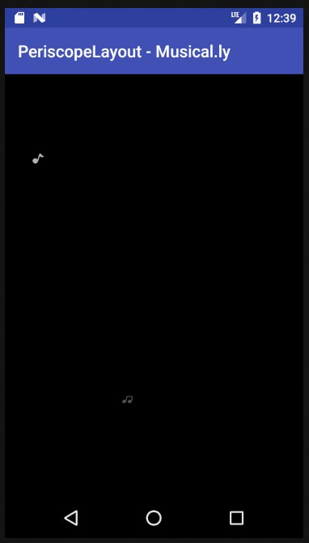

# PeriscopeLayout
A layout with animation like Musical.ly

Show effect automatically after 1500ms, and show effects every 5000ms.
If you click on PeriscopeLayout, will stop effect.



## Usage

**Step One:**

```
    <com.yuri.PeriscopeLayout
        android:id="@+id/periscope"
        android:layout_width="match_parent"
        android:layout_height="match_parent"
        android:background="#000"/>
```

**Step Two:**

```
        final PeriscopeLayout periscopeLayout = (PeriscopeLayout) findViewById(R.id.periscope);
        periscopeLayout.showSymbol(1500, 5000);
        periscopeLayout.setOnClickListener(new View.OnClickListener() {
            @Override
            public void onClick(View v) {
//                periscopeLayout.showSymbol();
                periscopeLayout.stop();
            }
        });
```
